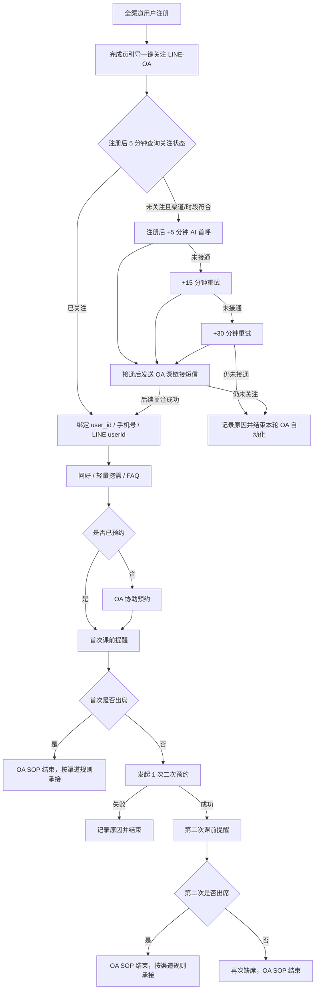
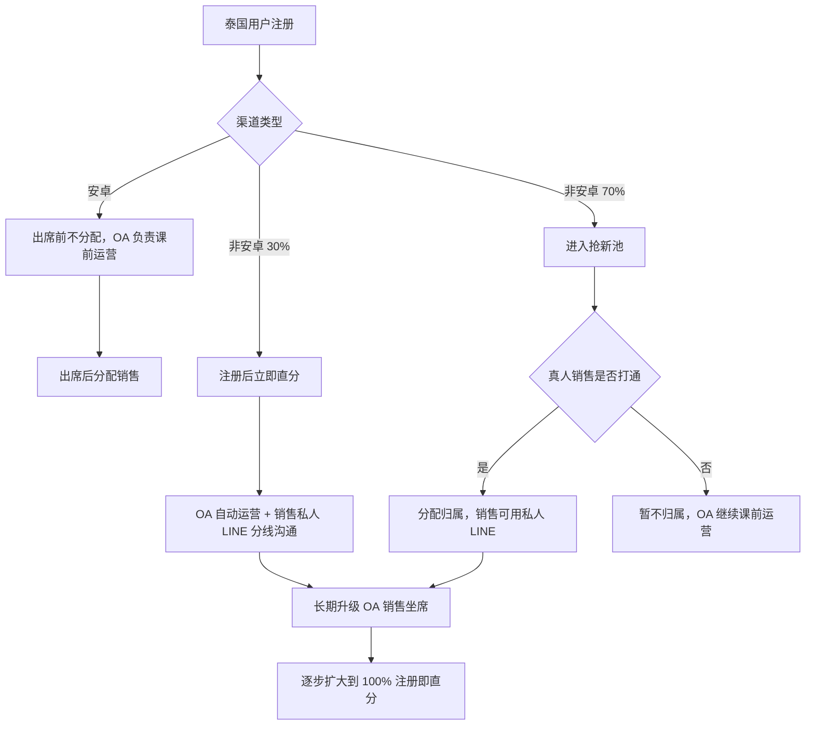

# 泰国 LINE-OA 课前运营与销售分配实验方案

版本：v1.0  
日期：2026-08-19  
状态：跨部门评审稿

## 核心结论

先把 LINE-OA 建成泰国所有渠道注册后的统一课前运营入口，再通过非安卓渠道 30% 直分 / 70% 抢新的随机实验验证销售归属机制。当前阶段允许 LINE-OA 与销售私人 LINE 分线沟通，但必须由 CRM 统一记录与控频；长期升级到销售 OA 坐席后，再扩大为 100% 注册即直分。

## 已确认规则

- 泰国市场，覆盖安卓与非安卓等所有注册渠道。
- 第三方工具支持 user_id / 手机号与 LINE userId 绑定，并可查询具体用户是否关注 OA。
- 注册完成页先引导关注，注册 5 分钟后查询。外呼仅对配置的较高转化渠道启用；外呼窗口暂定为泰国时间 08:00–21:00，注册和调用时点均须在窗口内，按注册后 +5 / +15 / +30 分钟最多尝试 3 次。接通或已关注即停止，超过 21:00 的尝试跳过且不顺延。
- 安卓渠道出席前不分配销售，出席后再分配。
- 非安卓 30% 注册后立即直分；OA 自动运营，销售用手机号搜索用户并以私人 LINE 单独沟通。
- 非安卓 70% 保持抢新，真人销售电话打通后才归属。
- 首次缺席后只进行 1 次二约；二约成功后继续第二次提醒；第二次出席或再次缺席后结束。

## 主流程

## 关注率建议

1. 注册完成页移动端使用一键关注深链接，桌面端同时显示二维码。
2. 若注册/登录链路允许，优先评估 LINE Login add friend option 与 Friendship Status API。
3. 注册后 5 分钟按已绑定的用户身份查询关注状态，仅对配置渠道创建外呼任务。
4. 使用泰国时区控制外呼：窗口暂定 08:00–21:00，注册和调用时点均须在窗口内，按 +5/+15/+30 分钟最多三次；每次呼叫前重新查询，接通或已关注即停止，超窗跳过且不顺延。
5. AI 电话只说明关注价值并提示用户查收链接，不在电话中逐字符播报 OA ID。
6. 通话中或通话后发送可点击短信；OA ID 只作为深链接失败时的兜底。
7. 分别统计完成页自然关注率、各轮电话/短信补促增量、跳过原因和取消关注率。

核心口径：OA 关注率 = 统计窗口内成功绑定且 friendFlag=true 的去重注册用户数 / 符合条件的去重注册用户数。

## 销售分配 A/B 测试

30%/70% 必须系统随机、用户分组固定，并按渠道、注册日期/时段检查基线平衡。销售分配实验主指标使用注册至付费转化率和每注册用户收入；OA 关注率是全项目主指标，但不是分配实验唯一判断依据。

## 跨部门职责

| 部门/角色 | 核心任务 | 意义 |
|---|---|---|
| 项目负责人/PMO | 统一范围、里程碑、风险和跨部门决策 | 保证端到端结果，而非局部工具上线 |
| 市场 | 传递渠道参数；改造完成页；稳定实验流量 | 提升自然关注并实现渠道归因 |
| 产品/产研 | 接入 OA、绑定/查询、渠道白名单、+5/+15/+30 分钟外呼、泰国时区窗口、SOP、随机分组和退出开关 | 将业务规则固化为可靠系统能力 |
| 前端运营 | 泰语话术、FAQ、预约、提醒、二约、频控和质检 | 保证自动化真正帮助用户上课 |
| 销售运营 | 归属规则、容量、私人 LINE 协同 SOP 和冲突处理 | 避免抢单争议、重复触达和负载不均 |
| 真人销售 | 执行电话/私人 LINE；查看 OA 摘要；回写结果；课后转化 | 将 AI 信息沉淀转为高价值人工跟进 |
| 数据/BI | 漏斗、实验校验、指标口径、显著性和异常监控 | 判断真实增量与因果效果 |
| 法务/合规/安全 | 通信同意、隐私、权限、保存周期、退订和审计 | 控制个人信息和通信风险 |
| 第三方供应商 | SLA、Webhook、状态查询、日志、坐席与故障恢复 | 避免关键链路成为黑盒 |

## 长期演进

1. P0：端到端链路验收。
2. P1：全渠道小流量验证自然关注与 AI 电话/短信补促。
3. P2：非安卓 30%/70% 销售分配 A/B 测试。
4. P3：按 30% → 50% → 80% → 100% 扩大直分比例。
5. P4：每位销售配置 LINE-OA 坐席，在同一 OA 会话中实现机器人/真人接管、恢复与审计。

## 官方依据

- [LINE Login add friend option](https://developers.line.biz/en/docs/line-login/link-a-bot/)
- [LINE Login Friendship Status API](https://developers.line.biz/en/reference/line-login/#get-friendship-status)
- [LINE URL Scheme](https://developers.line.biz/en/docs/messaging-api/using-line-url-scheme/)
- [Messaging API webhook](https://developers.line.biz/en/docs/messaging-api/receiving-messages/)

注：AI 电话后的短信深链接、触点归因、销售私人 LINE 协同和 A/B 测试设计属于本项目建议，并非 LINE 官方强制流程。
